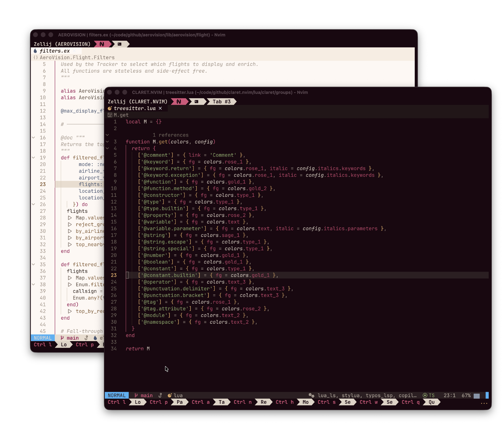
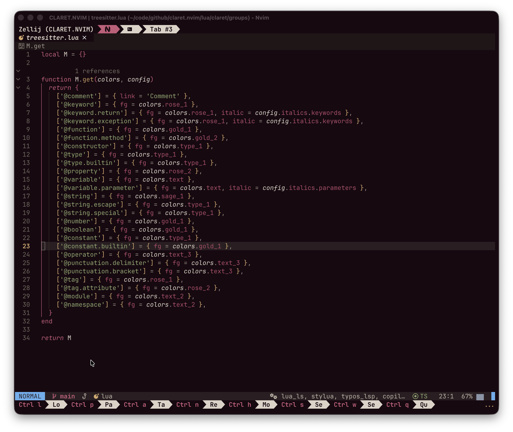
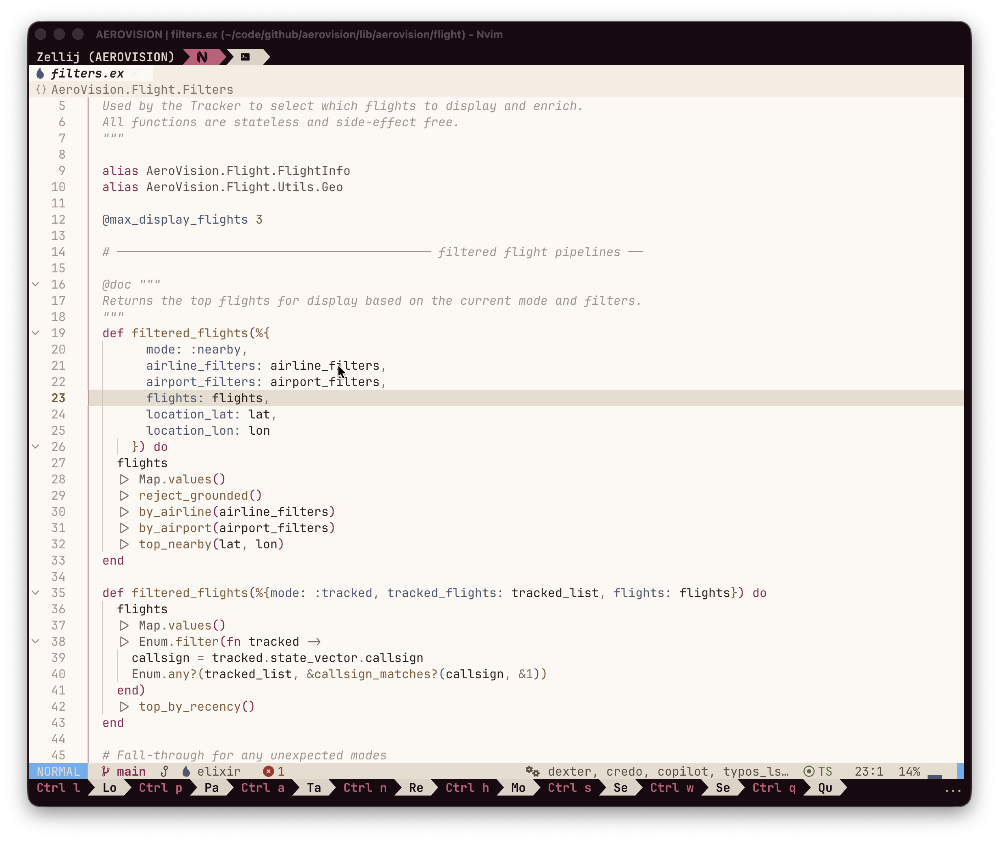

# claret.nvim

Warm Neovim colorscheme with burgundy, gold, and sage — inspired by French cuisine. 🍷

<p align="center">
  
</p>

## Variants

<details>
<summary><code>claret</code> — dark</summary>



</details>

<details>
<summary><code>claret-light</code> — light</summary>



</details>

## Install

```lua
{
  'cfbender/claret.nvim',
  priority = 1000,
  config = function()
    require('claret').setup({
      variant = 'auto',
      transparent = false,
    })
    vim.cmd.colorscheme('claret')
  end,
}
```

## Configuration

```lua
require('claret').setup({
  variant = 'auto',       -- 'auto' | 'dark' | 'light'
  transparent = false,
  italics = {
    comments = true,
    keywords = true,
    parameters = true,
    decorators = true,
  },
  groups = {},            -- raw group overrides, merged last
  overrides = function(colors)
    -- return a table of palette overrides, e.g. { rose_1 = '#FF00FF' }
    return {}
  end,
})
```

## Supported integrations

**Completion & UI**
- [blink.cmp](https://github.com/Saghen/blink.cmp)
- [noice.nvim](https://github.com/folke/noice.nvim)
- [snacks.nvim](https://github.com/folke/snacks.nvim)
- [which-key.nvim](https://github.com/folke/which-key.nvim)
- [flash.nvim](https://github.com/folke/flash.nvim)
- [nvim-window-picker](https://github.com/s1n7ax/nvim-window-picker)

**Statusline & structure**
- [heirline.nvim](https://github.com/rebelot/heirline.nvim)
- [lualine.nvim](https://github.com/nvim-lualine/lualine.nvim)
- [aerial.nvim](https://github.com/stevearc/aerial.nvim)
- [indent-blankline.nvim](https://github.com/lukas-reineke/indent-blankline.nvim)
- [rainbow-delimiters.nvim](https://github.com/HiPhish/rainbow-delimiters.nvim)
- [nvim-highlight-colors](https://github.com/brenoprata10/nvim-highlight-colors)

**Git & diffs**
- [gitsigns.nvim](https://github.com/lewis6991/gitsigns.nvim)
- [codediff.nvim](https://github.com/wintermute-cell/codediff.nvim)

**Notes, tasks, terminal**
- [todo-comments.nvim](https://github.com/folke/todo-comments.nvim)
- [grapple.nvim](https://github.com/cbochs/grapple.nvim)
- [toggleterm.nvim](https://github.com/akinsho/toggleterm.nvim)
- [markdown.nvim](https://github.com/MeanderingProgrammer/render-markdown.nvim)
- [chezmoi.nvim](https://github.com/xvzc/chezmoi.nvim)

**Diagnostics, test & debug**
- [tiny-inline-diagnostic.nvim](https://github.com/rachartier/tiny-inline-diagnostic.nvim)
- [nvim-dap](https://github.com/mfussenegger/nvim-dap)
- [nvim-dap-ui](https://github.com/rcarriga/nvim-dap-ui)
- [nvim-coverage](https://github.com/andythigpen/nvim-coverage)

**AI**
- [copilot.lua](https://github.com/zbirenbaum/copilot.lua)
- [sidekick.nvim](https://github.com/folke/sidekick.nvim)

## Ports

Matching themes for other tools live under [`ports/`](./ports). They are auto-generated from `lua/claret/palette.lua` — don't edit them directly.

| Tool | File | Install |
| --- | --- | --- |
| [bat](https://github.com/sharkdp/bat) | [`ports/bat/ClaretDark.tmTheme`](./ports/bat/ClaretDark.tmTheme) | Copy into `"$(bat --config-dir)/themes/"`, then `bat cache --build`. Use with `--theme=ClaretDark` or set `--theme="ClaretDark"` in `bat.conf`. |
| [ghostty](https://ghostty.org) | [`ports/ghostty/claret-dark.conf`](./ports/ghostty/claret-dark.conf) | Copy to `~/.config/ghostty/themes/claret-dark`, then add `theme = claret-dark` to `~/.config/ghostty/config`. |
| [opencode](https://opencode.ai) | [`ports/opencode/claret.json`](./ports/opencode/claret.json) | Copy to `~/.config/opencode/themes/claret.json`, then set `"theme": "claret"` in `opencode.json`. |
| [yazi](https://yazi-rs.github.io) | [`ports/yazi/claret-dark.toml`](./ports/yazi/claret-dark.toml) | Copy to `~/.config/yazi/theme.toml` (or merge into your existing `theme.toml`). |
| [zellij](https://zellij.dev) | [`ports/zellij/claret-dark.kdl`](./ports/zellij/claret-dark.kdl) | Copy to `~/.config/zellij/themes/claret-dark.kdl`, then set `theme "claret-dark"` in your zellij config. |

On macOS, replace `~/.config` with `$XDG_CONFIG_HOME` if you set it, or use the tool's documented config directory.

## Development

```sh
# Run the full test suite (palette, load, highlights, plugins, ports).
./scripts/test.sh

# Regenerate port files after changing the palette or generator.
nvim --headless -u tests/minimal_init.lua \
  -c "lua dofile('scripts/generate_ports.lua')" -c "qa!"
```

Git hooks (optional but recommended) — managed by [lefthook](https://github.com/evilmartians/lefthook) via [mise](https://mise.jdx.dev):

```sh
mise run hooks-install
```

The pre-commit hook regenerates port files automatically when `lua/claret/palette.lua`, `scripts/generate_ports.lua`, or anything under `ports/` changes, then re-stages them.

### Project layout

- `lua/claret/palette.lua` — locked palette values (dark + light)
- `lua/claret/config.lua` — defaults and user-config merge
- `lua/claret/theme.lua` — assembles every highlight group
- `lua/claret/groups/*.lua` — core groups (editor, syntax, diagnostics, …)
- `lua/claret/groups/plugins/*.lua` — per-plugin integrations
- `colors/*.lua` — colorscheme entrypoints
- `tests/*.lua` — headless smoke checks
- `scripts/generate_ports.lua` — generator for every file in `ports/`

### Adding a plugin integration

1. Add a new file under `lua/claret/groups/plugins/` that returns `{ get = function(colors, opts) ... end }`.
2. Register it in `lua/claret/theme.lua`.
3. Reuse semantic palette roles (`rose_*` for keywords, `gold_*` for functions, `sage_*` for strings, `slate_*` for types/tags, `terra_*` for errors) — don't invent new hues.
4. Add an assertion to `tests/plugins_spec.lua` covering one representative group.

### Changing the palette

1. Edit `lua/claret/palette.lua`.
2. Regenerate ports (or let the pre-commit hook do it).
3. Run `./scripts/test.sh` and update any hardcoded expectations in `tests/`.
